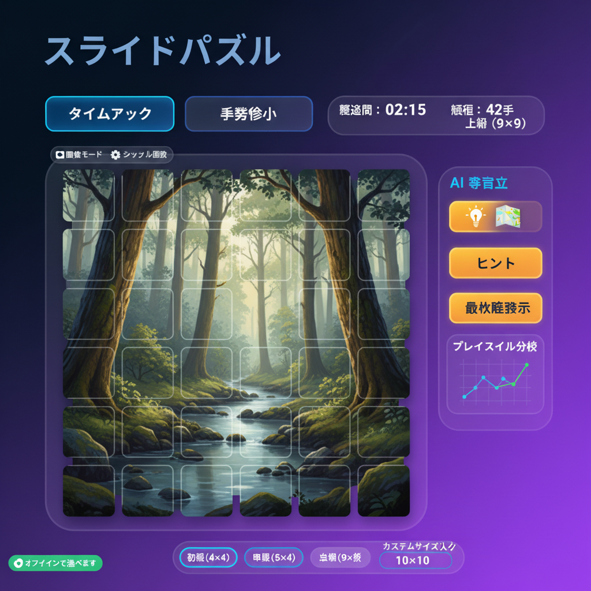

# Simple Puzzle - Custom Image Sliding Game

> 画像を選ぶ瞬間からゴールの達成音まで、体験全体を自分好みにチューニングできる Next.js 製 15 パズル。



## プロジェクト概要
スライド式の数字・画像パズルをオフラインでも遊べるように最適化し、Gemini 2.5 Flash & Gemini 2.5 Flash Image（コードネーム nano-banana）を活用してヒント提示・最適解生成・プレイスタイル分析・画像生成まで行う学習型アプリケーションです。画像アップロードやAI生成を通して常に新鮮な盤面を提供し、家族でもソロでも楽しめるように設計されています。

## 主な特徴
### 画像ソースの自由度
- ローカル画像アップロード（JPEG/PNG/GIF）に加え、Gemini 2.5 Flash Image によるテキスト→画像生成をサポート
- 動物・海・風景カテゴリのプリセットギャラリーを同梱

### ゲームモードと盤面
- 4×4 / 5×5 / 6×6 の難易度プリセットを用意（初級〜上級）
- フリープレイ / タイムアタック / 最小手数チャレンジの3モード
- Framer Motion を用いた 300ms スライドアニメと効果音で直感的な操作感を実現
- 伝統的な「1枚欠け」仕様を厳守し、常に空きマス1枚＋合法移動だけで盤面を崩す安全設計

### AI サポート
- A* アルゴリズムと Gemini による「次の一手」ヒント（1ゲーム3回まで）
- 最短ステップの可視化と、手数比較を含むプレイスタイル分析
- APIキーは `.env.local` もしくはアプリ内設定モーダルで安全に管理
- AI専用設定モーダルでGemini/Gemini Imageキーの貼り付け→検証→保存、AI補助トグル、ヒント上限などをまとめて操作

### 記録・分析
- クリア時間・手数・サイズ・画像サムネイルを IndexedDB(Dexie) へ保存
- 難易度別のベストスコアや推移グラフを Recharts で表示
- 効率スコアや改善ポイントを自動生成し、学習ループを提供

### PWA / オフライン
- next-pwa + Workbox による Service Worker でオフラインプレイ可
- 画像生成・AI解析以外の機能はネット切断時でも動作
- インストール対応（manifest + 192px/512px アイコン同梱）
- iOS/Android両対応の新規アイコンセット（180/152/120px & 256/192/Adaptive）を同梱予定

## UIモック（2025-11-19）
- タイトル下に「タイムアタック」「手数省エネ」等のチップ型モードトグルを配置し、アクティブモードをネオンブルーで強調
- 盤面右上のHUDカードで経過時間・手数・難易度をまとめて表示（ガラスモーフィズム調）
- 右サイドのAI参謀パネルはヒント→最適解→プレイスタイル分析スパークラインの順で縦積み
- 下部に初級/中級/上級チップとカスタムサイズスライダー（4×4〜10×10）を並列配置し、リアルタイムラベル表示
- 左下の「オフラインで遊べます」インジケータでService Worker状態を可視化

## 技術スタック & アーキテクチャ
- Next.js 14 App Router / React 18 / TypeScript
- Tailwind CSS 3 + Framer Motion で UI / 動画表現
- Zustand（状態）+ Dexie（IndexedDB）でクライアント永続化
- Google Generative AI（Gemini 2.5 Flash, Gemini 2.5 Flash Image）
- next-pwa, Workbox, Web Audio API, Canvas API

```
app/
├─ actions/ai.ts            # Gemini ヒント・解析 Server Actions
├─ actions/image.ts         # Gemini 2.5 Flash Image 生成 Server Actions
├─ page.tsx                 # 画像選択 + パズルメイン
components/
├─ ImageSelector.tsx        # アップロード / AI / プリセット UI
├─ PuzzleBoard.tsx          # ボード＆Tile描画
├─ GameControls.tsx         # モード・難易度・シャッフル
├─ AnalysisReport.tsx       # プレイスタイル分析
├─ SettingsModal.tsx        # APIキー & サウンド設定
lib/
├─ puzzle/*                 # 生成・検証・A* ソルバー
├─ image/*                  # 画像処理ユーティリティ
├─ ai/*                     # ヒント・分析ロジック
├─ db/*                     # Dexie スキーマ/CRUD
└─ utils/apiKeyStorage.ts   # APIキー保存ヘルパー
```

## セットアップ
1. Node.js 20.x / npm 10.x 以上を準備
2. 依存関係をインストール  
   ```bash
   npm install
   ```
3. `./.env.local` を作成して Gemini / Gemini Image 用 API キーを設定  
   ```env
   GEMINI_API_KEY=your_google_generative_ai_key
   GEMINI_IMAGE_API_KEY=your_google_generative_ai_image_key # 省略時は GEMINI_API_KEY を再利用
   ```
   ※ ブラウザ内の「設定」モーダルからもキーを保存／削除できます。
4. 開発サーバを起動  
   ```bash
   npm run dev
   ```
5. 本番ビルド + PWA 挙動確認  
   ```bash
   npm run build
   npm run start
   ```

## スクリプト一覧
| コマンド | 役割 |
| --- | --- |
| `npm run dev` | Next.js 開発サーバ（http://localhost:3000） |
| `npm run build` | 本番ビルド（PWA manifest / SW を含む） |
| `npm run start` | Production サーバ |
| `npm run lint` | ESLint |
| `npm run test` | Jest（ユニット / 統合） |
| `npm run test:watch` | Jest ウォッチモード |
| `npm run test:coverage` | カバレッジ出力 |
| `npm run test:e2e` | Playwright E2E |
| `npm run test:e2e:ui` / `:debug` | Playwright UI / デバッグラン |

## テスト戦略
- **Jest + Testing Library**: puzzleロジック、Server Actions、IndexedDB ヘルパーをモック付きで検証（`jest.setup.ts`/`fake-indexeddb`）
- **Playwright**: 画像選択→プレイ→履歴記録までの E2E。初回は `npx playwright install` を実行してブラウザバイナリを取得してください。

## データ永続化とオフライン
- Dexie ベースの IndexedDB にゲーム履歴・設定・プリセット画像をキャッシュ
- Service Worker がプリセット画像・音声・主要ルートをプリキャッシュし、二度目以降のアクセスを高速化
- API が利用できない場合は UI 層で明示的にエラーメッセージを表示し、プレイ自体は継続可能

## デザインアセット
- `png/nano-banana-1763530962994.png`: README / デザイン議論向けの最新UI俯瞰画像
- `png/pwa-icon.png`: ストアアイコンのドラフト
- `public/icons/*`: iOS/Android向けの刷新アイコン素材（coming soon）
- `public/presets/*`: プリセット画像（動物/海/風景）と `public/sounds/*`（効果音）

## ドキュメント
- [要件定義書](doc/requirements.md) — ユースケースとユーザー価値
- [技術設計書](doc/technical-design.md) — アーキテクチャ・データモデル
- [実装計画書](doc/implementation-plan.md) — フェーズ別タスクと工数

## ロードマップのヒント
- AI キー自動検証や Gemini 2.5 Flash Image と Gemini の個別レート制限管理
- モバイル長押しジェスチャー、アクセシビリティ（キーボード操作）強化
- リーダーボードや共有リンクの実装は `doc/implementation-plan.md` のフェーズ4以降に記載
