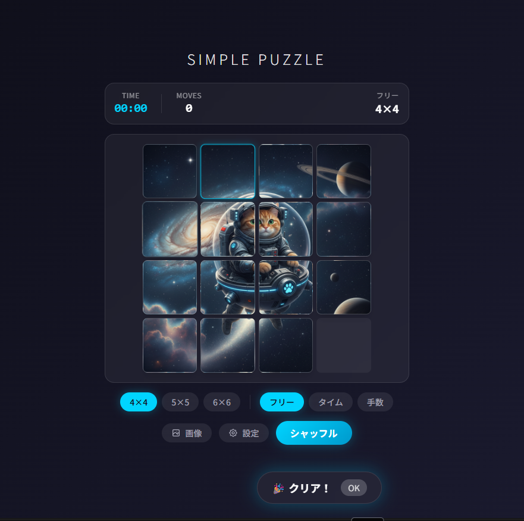

<a name="readme-top"></a>

<!-- PROJECT SHIELDS -->
[![Next.js][nextjs-shield]][nextjs-url]
[![TypeScript][typescript-shield]][typescript-url]
[![Tailwind CSS][tailwind-shield]][tailwind-url]
[![License][license-shield]][license-url]

<!-- PROJECT LOGO -->
<br />
<div align="center">
  <h1>🧩 Simple Puzzle</h1>

  <p align="center">
    画像を選ぶ瞬間からゴールの達成音まで、体験全体を自分好みにチューニングできる AI 搭載スライドパズル
    <br />
    <br />
    <a href="#-features">Features</a>
    ·
    <a href="#-getting-started">Getting Started</a>
    ·
    <a href="#-usage">Usage</a>
  </p>
</div>

## 📸 Screenshot

<div align="center">
  
  <p><em>AI画像生成 × スライドパズル × プレイ分析</em></p>
</div>

## ✨ Features

### 🎮 ゲームプレイ

- 🔢 **3つの難易度** — 4×4（初級）/ 5×5（中級）/ 6×6（上級）のサイズ選択
- 🎯 **3つのゲームモード** — フリープレイ / タイムアタック / 最小手数チャレンジ
- ✨ **スムーズなアニメーション** — Framer Motion による 300ms スライドアニメーション
- 🔊 **効果音** — Web Audio API によるインタラクティブなサウンド

### 🖼️ 画像カスタマイズ

- 📤 **画像アップロード** — JPEG / PNG / GIF をパズル化
- 🤖 **AI画像生成** — Gemini 2.5 Flash Image でテキストから画像を生成
- 🏞️ **プリセットギャラリー** — 動物・海・風景カテゴリの画像を同梱

### 🧠 AI サポート

- 💡 **ヒント機能** — A* アルゴリズム + Gemini による「次の一手」ヒント（1ゲーム3回まで）
- 🛤️ **最短経路表示** — 最適解のステップを可視化
- 📊 **プレイスタイル分析** — クリア後に効率スコアと改善ポイントを表示

### 💾 記録・分析

- 📈 **ゲーム履歴** — クリア時間・手数・サイズ・画像サムネイルを IndexedDB に保存
- 📉 **ベストスコア** — 難易度別のベストタイムと推移グラフを Recharts で表示
- 🔄 **学習ループ** — 効率スコアと改善ポイントの自動生成

### 📱 PWA / オフライン

- 🌐 **オフライン対応** — Service Worker でネット切断時もプレイ可能
- 📲 **インストール対応** — ホーム画面に追加してネイティブアプリ感覚で利用
- ⚡ **高速起動** — プリセット画像・音声・主要ルートをプリキャッシュ

## 🚀 Tech Stack

| Category | Technologies |
|----------|-------------|
| **Frontend** | [Next.js 14](https://nextjs.org/) (App Router) / [React 18](https://react.dev/) / [TypeScript](https://www.typescriptlang.org/) |
| **Styling** | [Tailwind CSS 3](https://tailwindcss.com/) / [Framer Motion](https://www.framer.com/motion/) |
| **State** | [Zustand](https://zustand-demo.pmnd.rs/) |
| **Database** | [Dexie](https://dexie.org/) (IndexedDB) |
| **AI** | [Google Generative AI](https://ai.google.dev/) (Gemini 2.5 Flash / Gemini 2.5 Flash Image) |
| **PWA** | [next-pwa](https://github.com/shadowwalker/next-pwa) / [Workbox](https://developer.chrome.com/docs/workbox/) |
| **Charts** | [Recharts](https://recharts.org/) |
| **Testing** | [Jest](https://jestjs.io/) / [Playwright](https://playwright.dev/) |

## 🎯 Getting Started

### Prerequisites

- Node.js 20.x 以上
- npm 10.x 以上

### Installation

1. **リポジトリをクローン**

```bash
git clone https://github.com/your-username/simple-puzzle.git
cd simple-puzzle
```

2. **依存関係をインストール**

```bash
npm install
```

3. **環境変数を設定**

`.env.local` を作成して API キーを設定：

```env
# Gemini API Key（ヒント・分析機能用）
GEMINI_API_KEY=your_google_generative_ai_key

# Gemini Image API Key（画像生成用、省略時は GEMINI_API_KEY を再利用）
GEMINI_IMAGE_API_KEY=your_google_generative_ai_image_key
```

> **Note**: API キーはブラウザ内の「設定」モーダルからも保存できます。

4. **開発サーバを起動**

```bash
npm run dev
```

5. **ブラウザで開く**

[http://localhost:3000](http://localhost:3000) にアクセス

### PWA ビルド確認

```bash
npm run build
npm run start
```

<p align="right">(<a href="#readme-top">back to top</a>)</p>

## 📖 Usage

### 基本的な遊び方

1. **サイズを選択** — 4×4 / 5×5 / 6×6 からお好みの難易度を選択
2. **モードを選択** — フリー / タイム / 手数 から目的に合ったモードを選択
3. **画像を設定（任意）** — 「画像」ボタンから画像をアップロード or AI生成
4. **シャッフル** — 「シャッフル」ボタンでゲーム開始
5. **パズルを解く** — タイルをクリックして空きマスにスライド
6. **クリア！** — 完成すると分析レポートが表示されます

### AI機能の使い方

```
AI ボタン → ヒントを取得 / 最適解を表示
```

- ヒントは1ゲームあたり3回まで使用可能
- 最適解表示でA*アルゴリズムによる最短経路を確認

### キーボードショートカット

| ショートカット | アクション |
|---------------|----------|
| `←` `→` `↑` `↓` | タイル移動 |

## 🏗️ Project Structure

```
simple-puzzle/
├── app/
│   ├── actions/         # Server Actions (AI・画像生成)
│   ├── page.tsx         # メインページ
│   └── layout.tsx       # レイアウト
├── components/
│   ├── PuzzleBoard.tsx  # パズル盤面
│   ├── PuzzlePreview.tsx# メインゲームコンポーネント
│   ├── ImageSelector.tsx# 画像選択UI
│   ├── HintButton.tsx   # ヒントボタン
│   ├── AnalysisReport.tsx# プレイ分析
│   ├── hud/             # HUD コンポーネント
│   └── settings/        # 設定関連
├── lib/
│   ├── puzzle/          # パズルロジック（生成・検証・A*ソルバー）
│   ├── store/           # Zustand ストア
│   ├── db/              # Dexie (IndexedDB)
│   ├── ai/              # AI分析ロジック
│   └── image/           # 画像処理
├── public/
│   ├── presets/         # プリセット画像
│   └── sounds/          # 効果音
└── doc/                 # ドキュメント
```

## 🧪 Testing

```bash
# ユニットテスト
npm run test

# ウォッチモード
npm run test:watch

# カバレッジ
npm run test:coverage

# E2E テスト（初回は npx playwright install が必要）
npm run test:e2e

# E2E UIモード
npm run test:e2e:ui
```

## 🗺️ Roadmap

- [x] コアパズルロジック（生成・検証・ソルバー）
- [x] 画像アップロード・分割表示
- [x] Gemini 2.5 Flash Image による画像生成
- [x] A* ヒント機能
- [x] ゲーム履歴・分析
- [x] HUD（タイム・手数・難易度表示）
- [ ] AI設定パネル強化
- [ ] ネオングラデーション UI テーマ
- [ ] PWA オフライン強化
- [ ] モバイルジェスチャー対応
- [ ] リーダーボード機能

## 📝 Scripts

| コマンド | 説明 |
|---------|------|
| `npm run dev` | 開発サーバ起動（http://localhost:3000）|
| `npm run build` | 本番ビルド（PWA含む）|
| `npm run start` | 本番サーバ起動 |
| `npm run lint` | ESLint 実行 |
| `npm run test` | Jest テスト実行 |
| `npm run test:e2e` | Playwright E2E テスト |

## 🤝 Contributing

1. Fork the Project
2. Create your Feature Branch (`git checkout -b feature/amazing-feature`)
3. Commit your Changes (`git commit -m 'Add amazing feature'`)
4. Push to the Branch (`git push origin feature/amazing-feature`)
5. Open a Pull Request

## 📄 License

Distributed under the MIT License. See `LICENSE` for more information.

## 📚 Documentation

詳細なドキュメントは `doc/` ディレクトリを参照してください：

- [要件定義書](doc/requirements.md) — ユースケースとユーザー価値
- [技術設計書](doc/technical-design.md) — アーキテクチャ・データモデル
- [実装計画書](doc/implementation-plan.md) — フェーズ別タスクと工数

<p align="right">(<a href="#readme-top">back to top</a>)</p>

<!-- MARKDOWN LINKS & IMAGES -->
[nextjs-shield]: https://img.shields.io/badge/Next.js_14-000000?style=for-the-badge&logo=nextdotjs&logoColor=white
[nextjs-url]: https://nextjs.org/
[typescript-shield]: https://img.shields.io/badge/TypeScript-3178C6?style=for-the-badge&logo=typescript&logoColor=white
[typescript-url]: https://www.typescriptlang.org/
[tailwind-shield]: https://img.shields.io/badge/Tailwind_CSS-06B6D4?style=for-the-badge&logo=tailwindcss&logoColor=white
[tailwind-url]: https://tailwindcss.com/
[license-shield]: https://img.shields.io/badge/License-MIT-yellow.svg?style=for-the-badge
[license-url]: LICENSE
